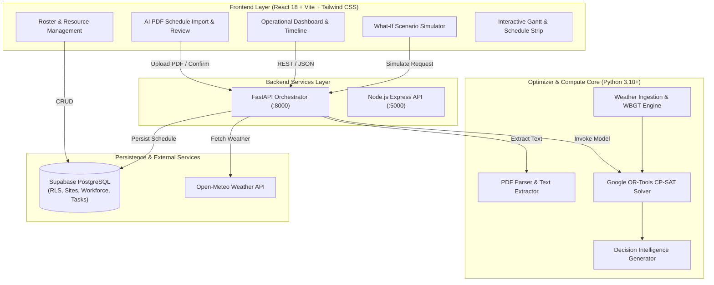

<div align="center">

# 🌡️ ThermoShift
### *Intelligent Heat-Aware Workforce Scheduling & Decision Intelligence*

[](LICENSE)
[](https://python.org)
[](https://www.typescriptlang.org/)
[](https://reactjs.org/)
[](https://developers.google.com/optimization)
[](https://supabase.com)
[](optimizer/tests)

<p align="center">
  <b>A supervisor-facing decision-support system that generates mathematically optimal, heat-safe work-and-rest schedules for outdoor industrial sites under extreme thermal stress.</b>
</p>

[Key Features](#-key-features) • [Architecture](#-system-architecture) • [PDF Import Pipeline](#-ai-pdf-schedule-import--normalization) • [Optimization Engine](#-mathematical-optimization-engine) • [Quick Start](#-quick-start-guide) • [Safety Framework](#-occupational-safety-framework)

---

</div>

## 📌 Executive Summary

High-temperature outdoor worksites (construction, oil & gas, mining, utilities, and infrastructure) face an escalating operational challenge: **ambient heat waves degrade physical performance and risk severe heat illness**, yet project milestones remain non-negotiable.

Traditional manual shift scheduling fails when temperatures spike unpredictably. **ThermoShift** solves this by formulating site operations into a **Constraint Programming (CP-SAT)** model that dynamically synchronizes:

1. **Environmental Heat Physics**: Real-time hourly Wet-Bulb Globe Temperature (WBGT) computed via ambient temperature, relative humidity, wind speed, and solar irradiance.
2. **Physiological Work-Rest Boundaries**: Dynamic break requirements scaled by metabolic workload intensity (light, moderate, heavy, severe) and sun exposure.
3. **Trade Certification Matrix**: Multi-trade worker assignments (welding, electrical, heavy equipment, carpentry, masonry).
4. **Physical Site Resource Caps**: Hard capacity limits on air-conditioned recovery trailers, hydration stations, and shade structures.
5. **Project Milestone Precedence**: Task dependency graphs, durations, and target deadlines extracted directly from project PDFs.

```
       ENVIRONMENT                  WORKFORCE                   RESOURCES
 ┌──────────────────────┐    ┌──────────────────────┐    ┌──────────────────────┐
 │  Live Weather Feed   │    │  Certified Trades    │    │  Cooling Trailers    │
 │  WBGT Heat Stress    │    │  Acclimatization     │    │  Shade Structures    │
 │  Solar Irradiance    │    │  Shift Availabilities│    │  Hydration Points    │
 └──────────┬───────────┘    └──────────┬───────────┘    └──────────┬───────────┘
            │                           │                           │
            └───────────────────────────┼───────────────────────────┘
                                        ▼
                 ┌─────────────────────────────────────────────┐
                 │       ThermoShift CP-SAT Optimizer          │
                 │   (Google OR-Tools Mathematical Engine)     │
                 └──────────────────────┬──────────────────────┘
                                        ▼
                 ┌─────────────────────────────────────────────┐
                 │          EXACT OPERATIONAL DISPATCH         │
                 │   WHO  •  WHAT  •  WHEN  •  WHERE  •  REST  │
                 └─────────────────────────────────────────────┘
```

---

## ✨ Key Features

<table>
  <tr>
    <td width="50%">
      <h3>📄 AI PDF Schedule Import</h3>
      <ul>
        <li>Direct ingestion of real-world PDF construction & industrial schedules.</li>
        <li>Multi-pass regex & LLM extraction of activities, crew sizes, durations, and dependencies.</li>
        <li><b>Strict Normalization Layer</b>: Validates bounds, formats, and trades; highlights missing data with <code>needs_review</code> badges without crashing.</li>
        <li><b>Human-in-the-Loop Review</b>: Supervisors review, edit, and confirm extracted activities before optimization.</li>
      </ul>
    </td>
    <td width="50%">
      <h3>🌤️ Live Weather & WBGT Modeling</h3>
      <ul>
        <li>Direct integration with <b>Open-Meteo API</b> for live microclimate forecasting.</li>
        <li>Computes <b>Wet-Bulb Temperature ($T_w$)</b> via the <i>Stull Empirical Equation</i> and calculates outdoor WBGT using ISO 7243 / Liljegren principles.</li>
        <li>Solar radiation and wind-speed attenuation adjustments.</li>
      </ul>
    </td>
  </tr>
  <tr>
    <td width="50%">
      <h3>⚡ OR-Tools CP-SAT Optimizer</h3>
      <ul>
        <li>15-minute slot resolution across full shift horizons.</li>
        <li>Hard mathematical guarantees: no worker exceeds safe heat limits.</li>
        <li><b>3 Strategic Solver Modes</b>:
          <ul>
            <li><code>BALANCED</code>: Optimum blend of progress & recovery.</li>
            <li><code>FASTEST</code>: Deadline-driven earliest delivery.</li>
            <li><code>SAFEST</code>: Maximum thermal safety margins.</li>
          </ul>
        </li>
      </ul>
    </td>
    <td width="50%">
      <h3>🧪 "What-If" Counterfactual Engine</h3>
      <ul>
        <li>Test real-time operational contingencies in memory:
          <ul>
            <li>🌡️ Sudden temperature surge (+2°C to +8°C).</li>
            <li>👷 Worker absenteeism / unexpected sick leave.</li>
            <li>⛺ Cooling trailer power loss / shade capacity drop.</li>
            <li>⏱️ Accelerated milestone deadlines.</li>
          </ul>
        </li>
        <li>Side-by-side delta visualization without database mutations.</li>
      </ul>
    </td>
  </tr>
  <tr>
    <td colspan="2">
      <h3>🧠 Deterministic Decision Intelligence</h3>
      <ul>
        <li>Every schedule assignment includes an explainability trace:
          <code>Fact → Reason → Impact</code>.</li>
        <li>Supervisors receive clear justifications for why high-intensity tasks were shifted to morning hours or why specific recovery breaks were enforced.</li>
        <li>Zero black-box decisions — mathematical transparency from input to dispatch.</li>
      </ul>
    </td>
  </tr>
</table>

---

## 📄 AI PDF Schedule Import & Normalization

ThermoShift includes a resilient PDF schedule ingestion pipeline designed for real-world project schedules:

```
RAW PDF / LLM OUTPUT
        ↓
VALIDATE & SANITIZE (sanitizeTaskCandidate, sanitizeProjectMetadata, sanitizeWorkforceGroup, sanitizeResourceItem)
        ↓
SAFE STRUCTURED SCHEDULE (ExtractedTaskCandidate[] with predictable types & review flags)
        ↓
SUPERVISOR REVIEW SCREEN (Inline editing, dependency visualization, missing field alerts)
        ↓
DATABASE PERSISTENCE & DETERMINISTIC CP-SAT OPTIMIZER
```

### Ingestion Guarantees:
- **Null-Safe String & Number Normalization**: Unsafe operations are protected through centralized type-safe helpers.
- **Traceable Sourcing**: Tracks page references, text snippets, and confidence levels for every extracted task.
- **Circular Dependency Detection**: Validates dependency DAGs and alerts the supervisor of cyclical prerequisites.
- **No Fabricated Data**: Missing fields display explicit `"Needs Review"` indicators and require supervisor confirmation before solving.

---

## 🏗️ System Architecture



---

## 🧮 Mathematical Optimization Engine

ThermoShift formulates shift assignment as a discrete **Constraint Satisfaction & Optimization Problem (COP)**:

$$\min \quad w_1 \cdot \text{Makespan} + w_2 \cdot \sum \text{HeatPenalties} + w_3 \cdot \sum \text{ResourceOverhead}$$

### Core Constraints Formulated in CP-SAT

1. **Trade Qualification Invariant**:
   $$\forall t \in \text{Tasks}, \forall w \in \text{AssignedWorkers}(t): \quad \text{RequiredSkill}(t) \subseteq \text{Skills}(w)$$

2. **Thermal Work-Rest Recovery Schedule**:
   $$\text{ContinuousWorkMinutes}(w, \text{interval}) \le \text{MaxSafeExposure}(\text{WBGT}(\text{interval}), \text{Intensity}(t))$$

3. **Cooling Infrastructure Bounds**:
   $$\forall \text{slot } s, \quad \sum_{w \in \text{RestingWorkers}(s)} 1 \le \sum_{r \in \text{RecoveryAssets}} \text{Capacity}(r)$$

4. **Task Precedence & Dependency Chain**:
   $$\text{StartSlot}(t_B) \ge \text{EndSlot}(t_A) \quad \forall (t_A \to t_B) \in \text{Dependencies}$$

---

## 🚀 Quick Start Guide

### Prerequisites
- **Python 3.10+**
- **Node.js 18+** & **npm**
- **Supabase Account** (or local in-memory fallback)

---

### 1. Clone & Setup Environment

```bash
# Clone the repository
git clone https://github.com/HAFIZ-HAASHIM/thermoshift.git
cd thermoshift

# Copy environment templates
cp frontend/.env.example frontend/.env.local
cp backend/.env.example backend/.env
cp optimizer/.env.example optimizer/.env
```

### 2. Configure Optimizer & Run Python Services

```bash
# Initialize Python virtual environment
python -m venv optimizer/venv

# Activate environment
# On Windows:
.\optimizer\venv\Scripts\activate
# On Linux/macOS:
source optimizer/venv/bin/activate

# Install dependencies
pip install -r optimizer/requirements.txt

# Run the complete test suite (131 unit, integration & import tests)
pytest optimizer/tests/ -v

# Launch the FastAPI Optimizer & PDF Extraction Engine
python -m uvicorn optimizer.engine.api:app --host 127.0.0.1 --port 8000 --reload
```

### 3. Launch Frontend Dashboard

```bash
cd frontend
npm install
npm run dev
```

The web dashboard will be active at **`http://localhost:5173`** (or `http://localhost:3000`).

---

## 🧪 Comprehensive Verification Suite

The repository contains an exhaustive test suite covering PDF ingestion, thermal calculations, mathematical optimization models, scenario simulations, and decision intelligence.

```bash
# Run all tests
pytest optimizer/tests/ -v

# Run PDF Import regression suite
pytest optimizer/tests/test_pdf_import.py -v

# Run Scenario Simulation suite
pytest optimizer/tests/test_scenario_simulation.py -v
```

---

## 📂 Repository Structure

```text
thermoshift/
├── frontend/                  # React 18 + TypeScript + Vite Web Application
│   ├── src/
│   │   ├── components/        # Operational Timeline, Roster, What-If UI, ScheduleImport
│   │   │   ├── ScheduleImport/ # PDF Drag-and-Drop, Extraction Progress & Review Table
│   │   │   ├── ErrorBoundary.tsx # Resilient Error Recovery Component
│   │   │   └── ...
│   │   ├── services/          # Supabase Client, Import API & Optimizer API Integrations
│   │   ├── types/             # Strict TypeScript Definitions (Schedule, Import, Decision)
│   │   └── utils/             # Formatters, Null-Safe String Handlers & WBGT Utilities
├── backend/                   # Node.js Express REST Backend Layer
├── optimizer/                 # Core Python Optimization Engine
│   ├── engine/
│   │   ├── api.py             # FastAPI REST Microservice
│   │   ├── model.py           # Google OR-Tools CP-SAT Scheduling Formulation
│   │   ├── schedule_importer.py # PDF Parsing & Structured Extraction Service
│   │   ├── weather.py         # Open-Meteo & Stull/ISO-7243 WBGT Computation
│   │   ├── explainer.py       # Deterministic Decision Intelligence Engine
│   │   └── counterfactuals.py # What-If Simulation Engine
│   └── tests/                 # 131 Automated Unit, Integration & PDF Import Tests
├── supabase/                  # Database Schemas, RLS Policies & Migrations
│   ├── migrations/            # Relational PostgreSQL Table Definitions
│   └── seed.sql               # Reference Development Dataset
├── ThermoShift_Test_Project_Schedule.pdf # Test Construction Schedule Document
└── README.md                  # Project Documentation
```

---

## 🛡️ Occupational Safety Framework

> **⚠️ Regulatory & Clinical Disclaimer**:  
> ThermoShift is an **operational decision-support tool** designed to assist site supervisors in planning workflow breaks. It incorporates academic and occupational thermal safety models (including principles from **OSHA**, **NIOSH**, and the **ISO 7243** standard for hot environments).  
>  
> ThermoShift **does not** provide medical diagnosis, biometric monitoring, or a statutory guarantee of individual worker safety. Local labor regulations, real-time wet-bulb measurements, and supervisor safety oversight must always supersede algorithmic recommendations.

---

## 📄 License

This project is licensed under the **MIT License** — see the [LICENSE](LICENSE) file for details.
